# LangChain을 활용한 LLM 기반 AI 서비스 개발 프로젝트:   AI 학습 메이트 

***
## 📌개발 목적 및 배경
혼자 공부하기 힘든 내용, 좀 더 효율적이고 체계적으로 공부할 수 있는 방법은 없나?  
그렇게 생각한 적이 한 번쯤은 있을 것이다.  
AI 학습 메이트는 독학의 어려움을 줄이고, 체계적인 학습을 도와줄 수 있도록
음성 요약, PDF 요약 및 문제 생성, 학습 일정 관리 등을 제공하는 웹 기반 AI 학습 도우미이다. 

***
## 🧑‍💻팀원 및 역할
| 이름  | 담당 역할           |
|:----|:----------------|
| 김송희 | 페이지 제작, 프로젝트 개발 |
| 정태원 | 페이지 제작, 프로젝트 개발 |
| 유진현 | 페이지 제작, 프로젝트 개발 |
***
**기간 :**  2025.08.18 ~ 2025.08.29
***
## 프로젝트 계획도
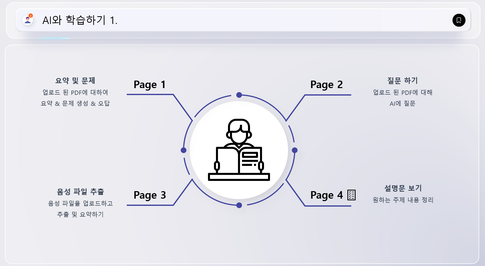
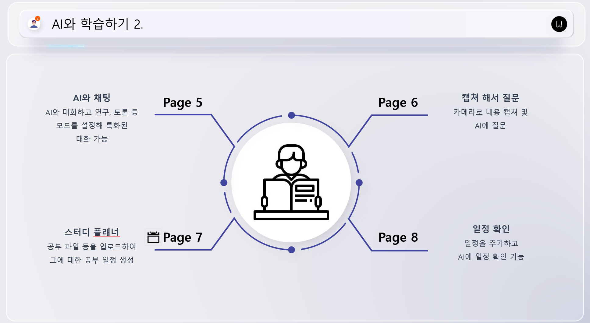

***
## 🛠 개발환경 및 개발도구

도구: Python, Github, Streamlit, OpenAi, Gemini, LangChain 

| 기술 / 도구         | 설명                                 |
|------------------|------------------------------------|
| Python           | 핵심 로직 구현                        |
| Streamlit        | 웹 기반 UI 프레임워크                  |
| LangChain        | LLM 연동 및 단계별 프롬프트 구성            |
| OpenAI / Gemini | LLM 기반 요약, 생성, 질의 처리           |

***

## ✅주요기능

### Main Page
- 주요 기능 설명

### 📚 **Page 1. 개념 학습하기**
- PDF 업로드 → 요약 → 문제 생성 → 사용자 풀이 → 채점 및 오답 표시  

### ❓ **Page 2. 모르는 문제 질문하기**
- 사용자가 질문 입력 → AI 답변

### 🎧 **Page 3. 녹음내용 요약하기**
- 음성 파일 업로드 → 텍스트 변환 → 핵심 요약 제공  

### 📝 **Page 4. 설명문 생성**
- 사용자가 주제 및 참고문헌 등 옵션 선택  → 참고 문헌을 기반으로 설명 제공 → 요약 및 체크리스트 생성

### ✅ **Page 5. AI 채팅**
- AI와 대화 형식, 연구/토론 모드 선택 가능

### ️ 📸 **Page 6. 캡쳐 및 질문**
- 사용자가 카메라에 내용 캡쳐 및 질문 → AI가 분석해 답변  

### 🗓 **Page 7. 학습 일정 관리**
- 사용자가 PDF 업로드 → 학습 기간 및 시간 입력 → 일정 체계 생성 

### 📊 **Page 8.달력 일정 확인**
- 사용자가 일정 추가, AI에 질문해 일정 확인 

***
## 화면 첨부
### 마이페이지
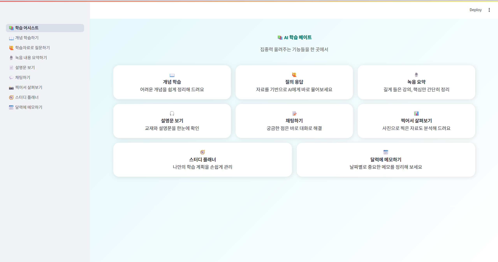
- 카테고리를 한 눈에 확인 가능

### Page1. 개념 학습하기
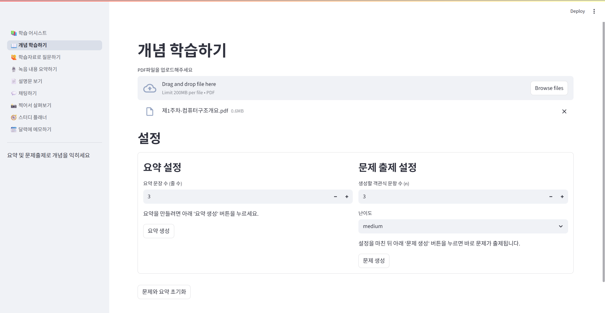
- 요약 및 문제풀이
- 업로드 된 PDF에 대하여 요약 및 문제 생성, 채점, 오답까지

### Page2. 학습자료로 질문하기
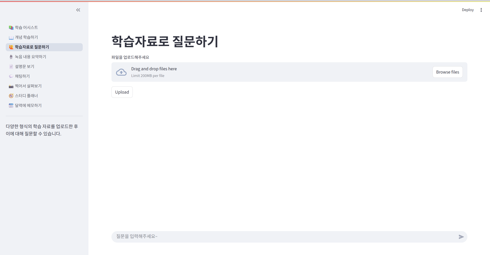
- 업로드된 PDF 내용에 대해 AI에 질문

### Page3. 녹음내용 요약하기
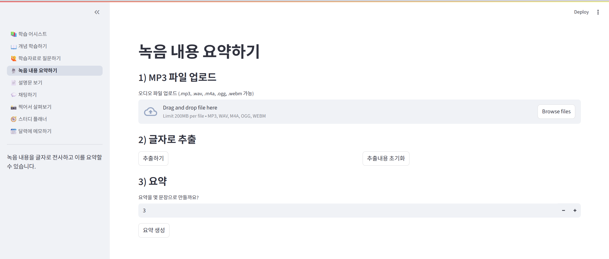
- 음성 파일을 업로드하고 텍스트로 추출 및 요약

### Page4. 설명문 생성
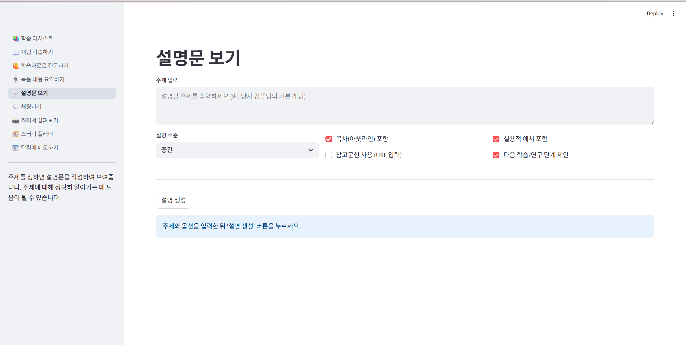
- 설명문 생성
- 원하는 주제 입력, 난이도 설정
- 목차, 실용 예시, 다음 학습/연구 단계 제안 옵션 선택
- 설명문에 참고하고 싶은 주소 추가

### Page5. 채팅하기 
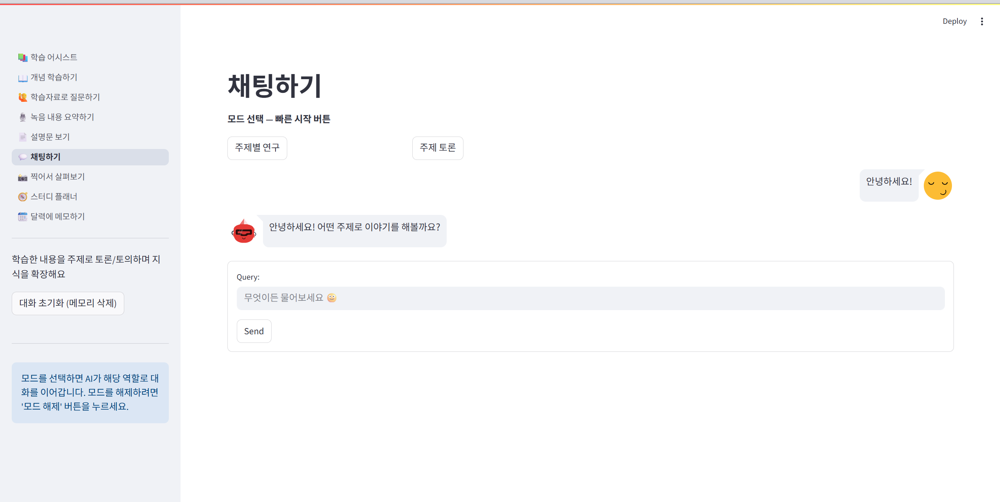
- AI와 대화 기능
- 연구, 토론 등 모드 선택 기능

### Page6. 찍어서 살펴보기
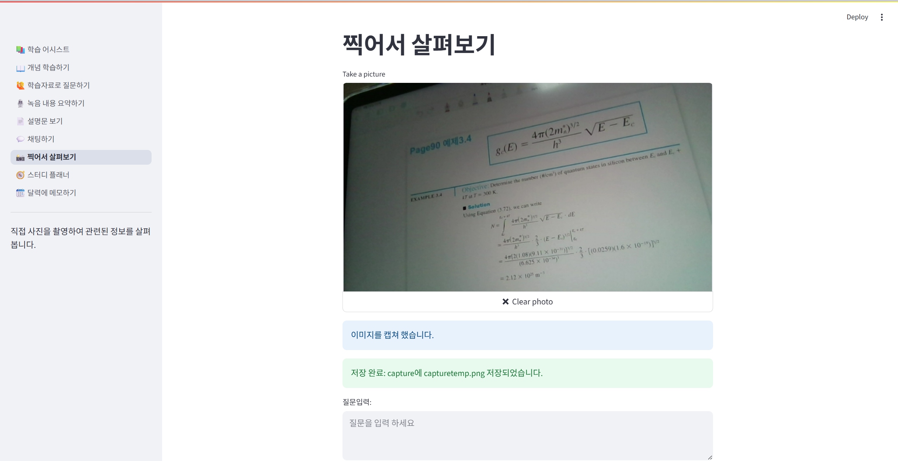
- 캡쳐된 내용 질문

### Page7. 스터디 플래너 
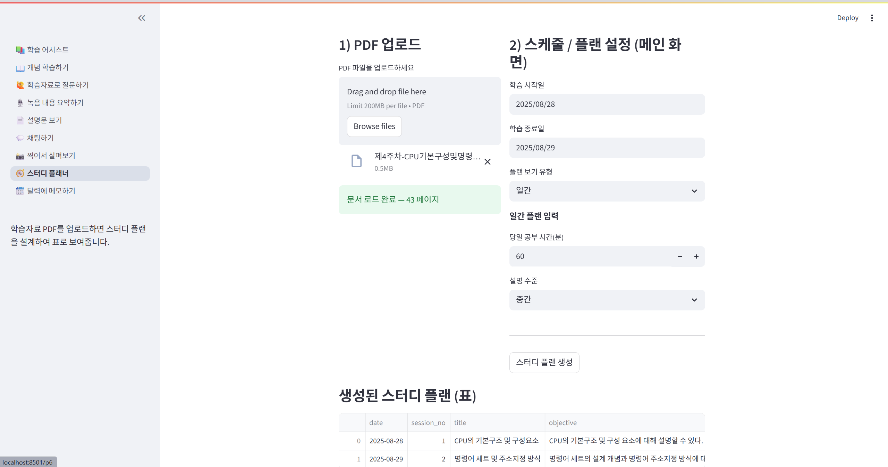
- 공부 파일을 업로드
- 그에 대한 공부 일정 세분화 하여 생성

### Page8. 달력에 메모하기
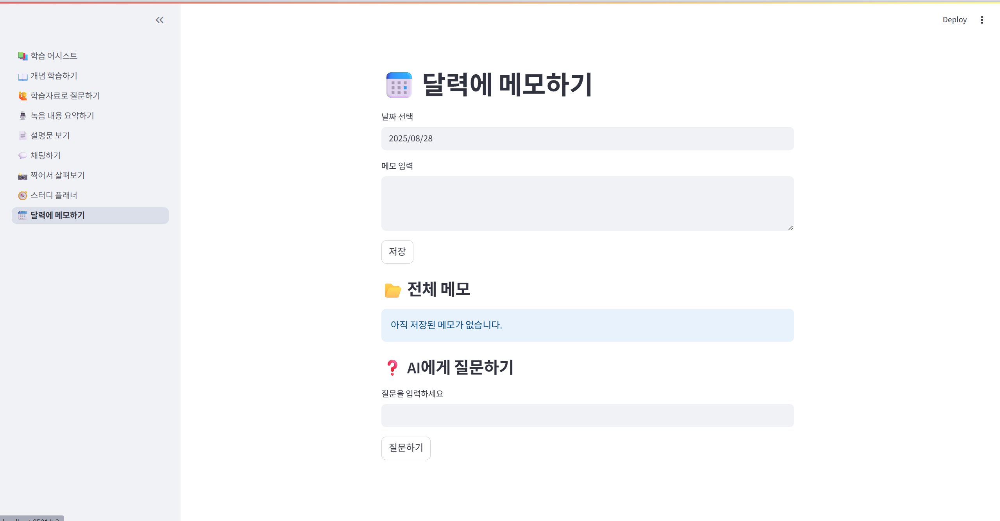
- 일정 추가
- AI가 일정 확인 및 찾기 기능
